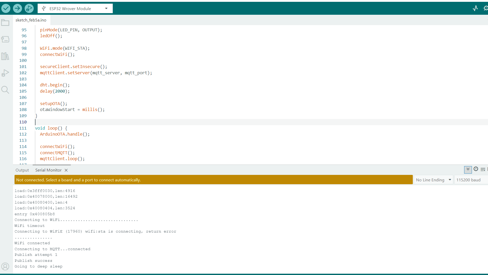
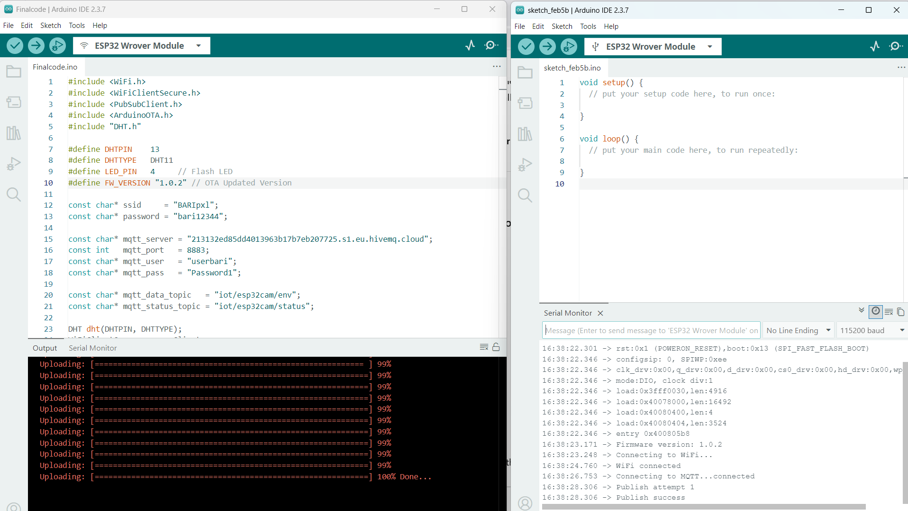
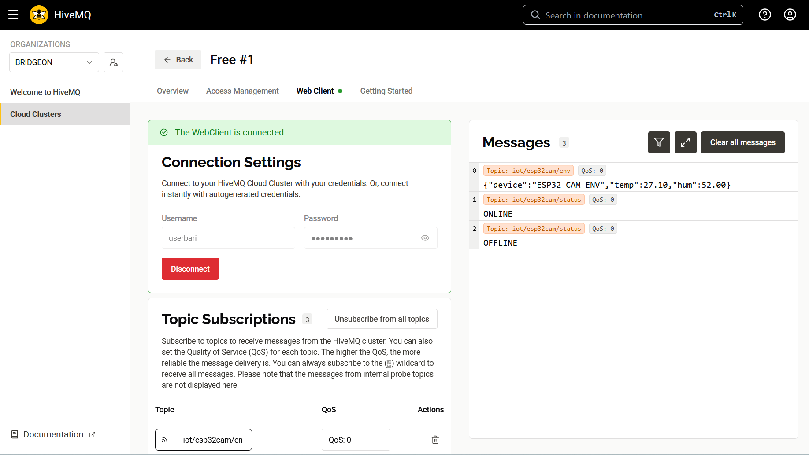

# ESP32-CAM Environmental Monitor (MQTT, OTA, Deep Sleep)

## Overview

This project uses an **ESP32-CAM module** to read temperature and humidity from a **DHT11 sensor** and send the data securely to **HiveMQ Cloud** using MQTT.

The device supports **OTA (Over-The-Air) firmware updates**, so new firmware can be uploaded without reconnecting a USB cable. To reduce power usage, the device automatically enters **deep sleep** after completing its work.

The **onboard flash LED (GPIO 4)** is used as a simple status indicator to show when the device is active.

Firmware versioning is included to make OTA updates easy to confirm.

---

## What the project does

* Connects to Wi-Fi with timeout handling
* Publishes sensor data securely using MQTT (TLS)
* Sends device status messages (online, sleeping, offline)
* Supports OTA firmware updates
* Uses deep sleep to save power
* Prints firmware version at boot for verification

---

## Hardware used

* **ESP32-CAM module**
* DHT11 temperature & humidity sensor
* **Onboard flash LED (GPIO 4)** used as activity indicator
* USB-TTL adapter (for first upload and debugging)

> The camera is part of the ESP32-CAM module but is not used in this version of the project.

---

## MQTT setup

The project uses **one MQTT broker** with **two topics**.

### Sensor data topic

```
iot/esp32cam/env
```

Example payload:

```json
{
  "device": "ESP32_CAM_ENV",
  "temp": 28.6,
  "hum": 61.2
}
```

### Status topic

```
iot/esp32cam/status
```

Status messages:

* `ONLINE` – device connected normally
* `SLEEPING` – device entered deep sleep
* `OFFLINE` – unexpected disconnect (Last Will message)

Keeping data and status separate makes monitoring easier.

---

## OTA update flow

1. ESP32-CAM boots or wakes from deep sleep
2. Connects to Wi-Fi and MQTT
3. OTA service starts
4. Device stays awake for a fixed OTA window
5. If an OTA update starts, deep sleep is blocked
6. After OTA or timeout, the device enters deep sleep

At every boot, the firmware version is printed:

```
Firmware version: 1.0.2
```

This confirms that a new OTA update is running.

---

## Power management

* Sensor data is sent **once per wake cycle**
* OTA window remains open for **60 seconds**
* Device then enters **deep sleep for 1 minute**
* Wi-Fi and MQTT are shut down cleanly before sleeping

This keeps power usage low while still allowing remote updates.

---

## Screenshots

### Hardware – Active (publishing data)

The flash LED turns on while the device is awake and sending data.


---

### Hardware – Deep sleep

Flash LED is off while the device is in deep sleep.


---

### Serial monitor logs

Wi-Fi connection, MQTT connection, and sensor data publishing.



---

### OTA update via Arduino IDE

OTA update in progress and new firmware running after update.



---

### MQTT messages in HiveMQ Cloud

Sensor data and status messages visible in the web client.



---

## Firmware versioning

Firmware version is defined in code:

```cpp
#define FW_VERSION "1.0.2"
```

* Version is updated with each OTA release
* GitHub code and device firmware stay in sync
* Makes testing and verification simple

---

## How to run

1. Update Wi-Fi and MQTT credentials in the code
2. Upload firmware once using USB
3. Open Serial Monitor to confirm connections
4. Perform OTA updates using Arduino IDE
5. View MQTT data using HiveMQ Cloud or MQTT Explorer

---

## Folder structure

```
ESP32-CAM-MQTT-OTA/
├── src/
│   └── main/
│       └── main.ino
├── images/
│   ├── hardware_active_led_on.png
│   ├── hardware_deep_sleep_led_off.png
│   ├── serial_monitor_wifi_mqtt_logs.png
│   ├── ota_update_arduino_ide.png
│   └── mqtt_messages_hivemq_cloud.png
└── README.md
```

---

## Summary

This project demonstrates a practical IoT setup using **ESP32-CAM**, combining secure MQTT communication, OTA firmware updates, and power-efficient deep sleep. It focuses on reliability and real-world usage rather than just a basic demo.

---

## Author

**Abdul Bari**
IoT & Embedded Developer

---